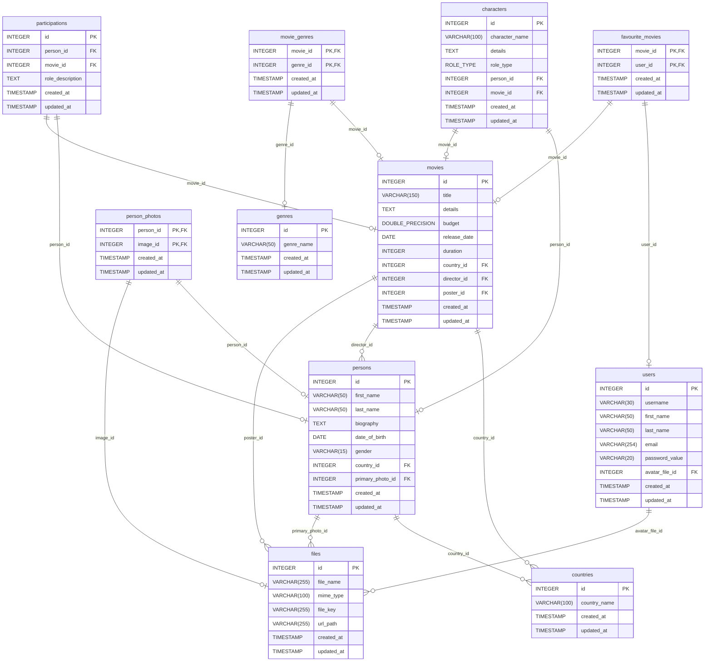

# BSA Database And SQL Task
### Diagram

```mermaid
erDiagram
    users {
        INTEGER id PK
        VARCHAR(30) username
        VARCHAR(50) first_name
        VARCHAR(50) last_name
        VARCHAR(254) email
        VARCHAR(20) password_value
        INTEGER avatar_file_id FK
        TIMESTAMP created_at
        TIMESTAMP updated_at
    }

    files {
        INTEGER id PK
        VARCHAR(255) file_name
        VARCHAR(100) mime_type
        VARCHAR(255) file_key
        VARCHAR(255) url_path
        TIMESTAMP created_at
        TIMESTAMP updated_at
    }

    countries {
        INTEGER id PK
        VARCHAR(100) country_name
        TIMESTAMP created_at
        TIMESTAMP updated_at
    }

    genres {
        INTEGER id PK
        VARCHAR(50) genre_name
        TIMESTAMP created_at
        TIMESTAMP updated_at
    }

    persons {
        INTEGER id PK
        VARCHAR(50) first_name
        VARCHAR(50) last_name
        TEXT biography
        DATE date_of_birth
        VARCHAR(15) gender
        INTEGER country_id FK
        INTEGER primary_photo_id FK
        TIMESTAMP created_at
        TIMESTAMP updated_at
    }

    person_photos {
        INTEGER person_id PK, FK
        INTEGER image_id PK, FK
        TIMESTAMP created_at
        TIMESTAMP updated_at
    }

    movies {
        INTEGER id PK
        VARCHAR(150) title
        TEXT details
        DOUBLE_PRECISION budget
        DATE release_date
        INTEGER duration
        INTEGER country_id FK
        INTEGER director_id FK
        INTEGER poster_id FK
        TIMESTAMP created_at
        TIMESTAMP updated_at
    }

    movie_genres {
        INTEGER movie_id PK, FK
        INTEGER genre_id PK, FK
        TIMESTAMP created_at
        TIMESTAMP updated_at
    }

    characters {
        INTEGER id PK
        VARCHAR(100) character_name
        TEXT details
        ROLE_TYPE role_type
        INTEGER person_id FK
        INTEGER movie_id FK
        TIMESTAMP created_at
        TIMESTAMP updated_at
    }

    favourite_movies {
        INTEGER movie_id PK, FK
        INTEGER user_id PK, FK
        TIMESTAMP created_at
        TIMESTAMP updated_at
    }

    participations {
        INTEGER id PK
        INTEGER person_id FK
        INTEGER movie_id FK
        TEXT role_description
        TIMESTAMP created_at
        TIMESTAMP updated_at
    }

    users ||--o{ files : "avatar_file_id"
    persons ||--o{ countries : "country_id"
    persons ||--o{ files : "primary_photo_id"
    movies ||--o{ countries : "country_id"
    movies ||--o{ persons : "director_id"
    movies ||--o{ files : "poster_id"
    person_photos ||--o| persons : "person_id"
    person_photos ||--o| files : "image_id"
    movie_genres ||--o| movies : "movie_id"
    movie_genres ||--o| genres : "genre_id"
    characters ||--o| persons : "person_id"
    characters ||--o| movies : "movie_id"
    favourite_movies ||--o| users : "user_id"
    favourite_movies ||--o| movies : "movie_id"
    participations ||--o| persons : "person_id"
    participations ||--o| movies : "movie_id"
```
